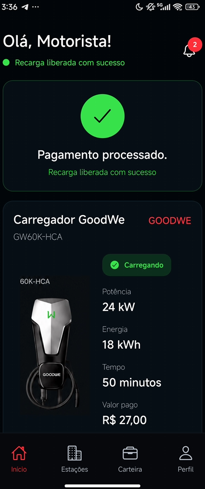
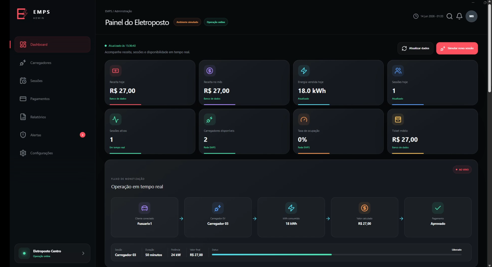

# EMPS – Energy Management and Payment Solution

## Sprint 2 – Prova de Conceito Funcional

Projeto desenvolvido para a Sprint 2 da disciplina **Soluções em Energias Renováveis e Sustentáveis** da FIAP, em parceria com o programa **EV Challenge 2026 – GoodWe**.

---

# Integrantes

* Arthur Maziviero Faria – RM 573928
* Tommaso C. Nagliatti – RM 572147
* Jun Uehara – RM 570537
* Felipe de Souza Gallo – RM 569680
* Roberson Reguero Luiz Junior – RM 573031
* Matheus Martins Lacerda – RM 570843

---

# Objetivo do Projeto

O EMPS (Energy Management and Payment Solution) é uma solução desenvolvida para demonstrar o gerenciamento inteligente de estações de recarga para veículos elétricos.

A proposta busca integrar:

* gerenciamento energético;
* monitoramento operacional;
* automação;
* sistema de pagamento;
* interoperabilidade entre sistemas;
* inteligência artificial aplicada à gestão energética.

O objetivo é transformar carregadores convencionais em uma infraestrutura inteligente, capaz de operar de forma mais eficiente, sustentável e economicamente viável.

---

# Problema

Com o crescimento da mobilidade elétrica, empresas, condomínios, estacionamentos e eletropostos precisam atender diversos usuários simultaneamente.

Sem gerenciamento inteligente podem ocorrer:

* sobrecarga elétrica;
* desperdício energético;
* baixa eficiência operacional;
* dificuldades de monitoramento;
* dificuldades de cobrança;
* utilização ineficiente da infraestrutura disponível.

Esses desafios aumentam os custos operacionais e dificultam a expansão da mobilidade elétrica sustentável.

---

# Solução Proposta

O EMPS é composto por dois sistemas principais:

## EMPS APP

Aplicativo utilizado pelo usuário final.

Funcionalidades demonstradas:

* conexão ao carregador;
* visualização da sessão de carregamento;
* geração de dados simulados;
* pagamento pré-pago;
* envio de informações para o sistema administrativo.

Repositório:

https://github.com/TommasoNagliatti/Emps-APP

---

## EMPS SEMS+

Painel administrativo responsável pelo monitoramento da estação.

Funcionalidades demonstradas:

* visualização dos carregadores;
* monitoramento de usuários conectados;
* recebimento dos dados enviados pelo aplicativo;
* indicadores operacionais;
* gestão inteligente de energia.

Repositório:

https://github.com/matheus00M7/emps-site

---

# Prova de Conceito Funcional

A prova de conceito desenvolvida demonstra a viabilidade técnica da solução através da integração entre aplicativo, backend e painel administrativo.

Fluxo demonstrado:

1. Usuário conecta o veículo ao carregador.
2. Aplicativo identifica o carregador utilizado.
3. Usuário realiza o pagamento da sessão.
4. O backend processa a solicitação.
5. Os dados são enviados ao painel administrativo.
6. O sistema realiza o monitoramento da operação.
7. A lógica de gestão energética distribui a potência disponível.

A demonstração comprova o funcionamento operacional da proposta apresentada na Sprint 1.

---

# Arquitetura da Solução

Fluxo simplificado da arquitetura:

Usuário

↓

EMPS APP

↓

API REST (Flask)

↓

EMPS SEMS+

↓

Gestão Inteligente de Energia

↓

Dashboard Administrativo

---

# Comunicação Entre Sistemas

Durante a prova de conceito, o aplicativo envia informações para o backend através de uma API REST.

Dados enviados:

* usuário conectado;
* carregador utilizado;
* status do pagamento.

Exemplo:

```json
{
  "usuario": "#usuario1",
  "carregador": "Carregador 03",
  "pagamento": "aprovado"
}
```

Esses dados são processados pelo backend e exibidos no painel administrativo.

---

# Aplicação de Python

O Python foi utilizado como tecnologia principal do backend da solução.

Através do framework Flask foi possível implementar:

* comunicação entre sistemas;
* recebimento de eventos;
* atualização do dashboard;
* integração entre aplicativo e painel administrativo;
* simulação do gerenciamento energético.

---

# Gestão Inteligente de Energia

A prova de conceito demonstra uma lógica de distribuição inteligente da potência disponível.

Exemplo:

Capacidade total da estação:

100 kW

Demanda total solicitada:

125 kW

Nesse cenário, o sistema redistribui automaticamente a potência entre os carregadores para evitar sobrecarga da infraestrutura.

Benefícios:

* redução de desperdícios;
* aumento da eficiência energética;
* proteção da rede elétrica;
* melhor utilização dos recursos disponíveis;
* maior sustentabilidade operacional.

---

# Justificativas Técnicas

## Aplicativo Mobile

Permite interação direta entre usuário e estação de recarga, facilitando autenticação, pagamento e acompanhamento da sessão.

## Backend Flask

Responsável pela comunicação entre os módulos da solução, processamento de dados e integração entre sistemas.

## Dashboard Administrativo

Permite monitoramento operacional centralizado e acompanhamento das sessões em tempo real.

## Inteligência Artificial

Possibilita futuras aplicações de análise de consumo, otimização energética e assistência operacional.

---

# Sustentabilidade e Energias Renováveis

O EMPS contribui diretamente para os princípios de sustentabilidade trabalhados durante o semestre.

A solução promove:

* uso mais eficiente da energia disponível;
* redução de desperdícios energéticos;
* melhor aproveitamento da infraestrutura elétrica;
* gerenciamento inteligente da demanda;
* apoio à expansão da mobilidade elétrica sustentável.

Ao evitar sobrecargas e distribuir adequadamente a potência entre os carregadores, o sistema contribui para uma operação mais eficiente e ambientalmente responsável.

---

# Demonstração da Solução

## EMPS APP




## EMPS SEMS+



---

# Vídeo Demonstrativo

Link:

https://youtu.be/6UnCF11kqz8

---

# Tecnologias Utilizadas

* Python
* Flask
* JavaScript
* React Native
* Expo
* HTML
* CSS
* REST API
* GitHub

---
# Como Utilizar a Solução

1. Abrir o aplicativo EMPS APP.
2. Selecionar o carregador desejado.
3. Realizar o pagamento da sessão.
4. Iniciar o carregamento.
5. Acompanhar a sessão pelo dashboard EMPS SEMS+.
6. Monitorar a distribuição de potência e indicadores energéticos.

# Conclusão

A prova de conceito desenvolvida demonstra a viabilidade técnica do EMPS como uma solução para gerenciamento inteligente de estações de recarga de veículos elétricos.

Mesmo em ambiente simulado, o sistema comprova a integração entre aplicativo, backend e painel administrativo, além de evidenciar os benefícios da gestão inteligente de energia.

Os resultados demonstram que a solução possui potencial para contribuir com a expansão da mobilidade elétrica sustentável, promovendo maior eficiência energética, melhor utilização da infraestrutura e redução de desperdícios operacionais.
